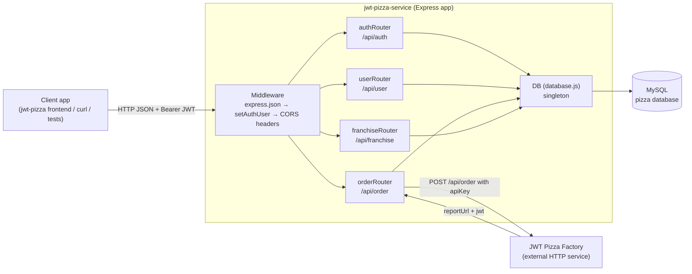
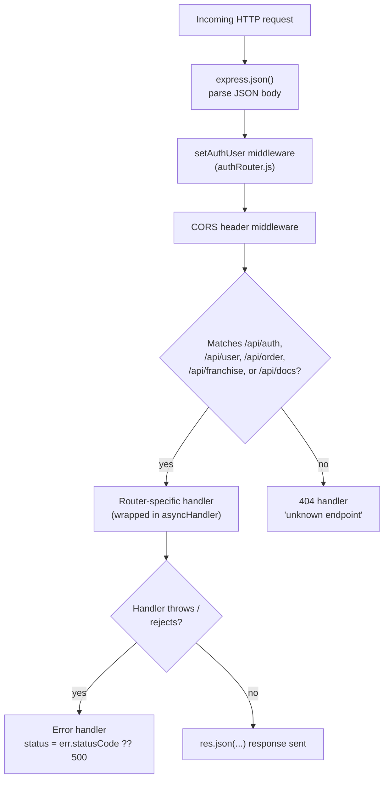
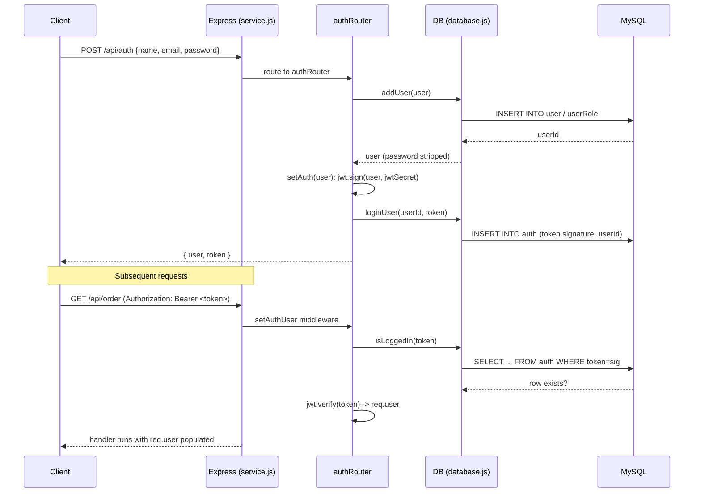
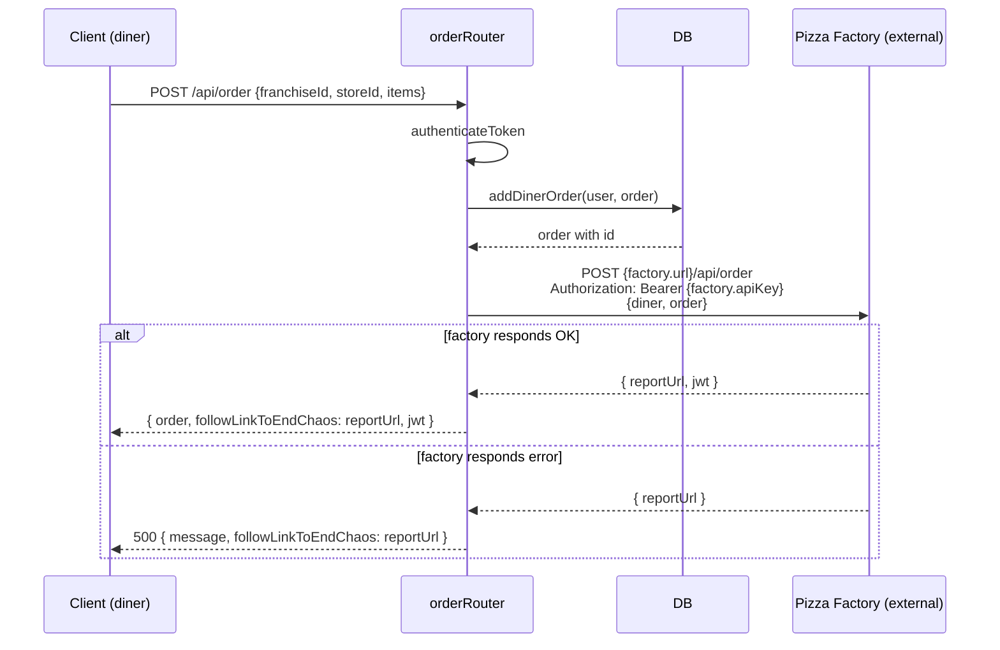
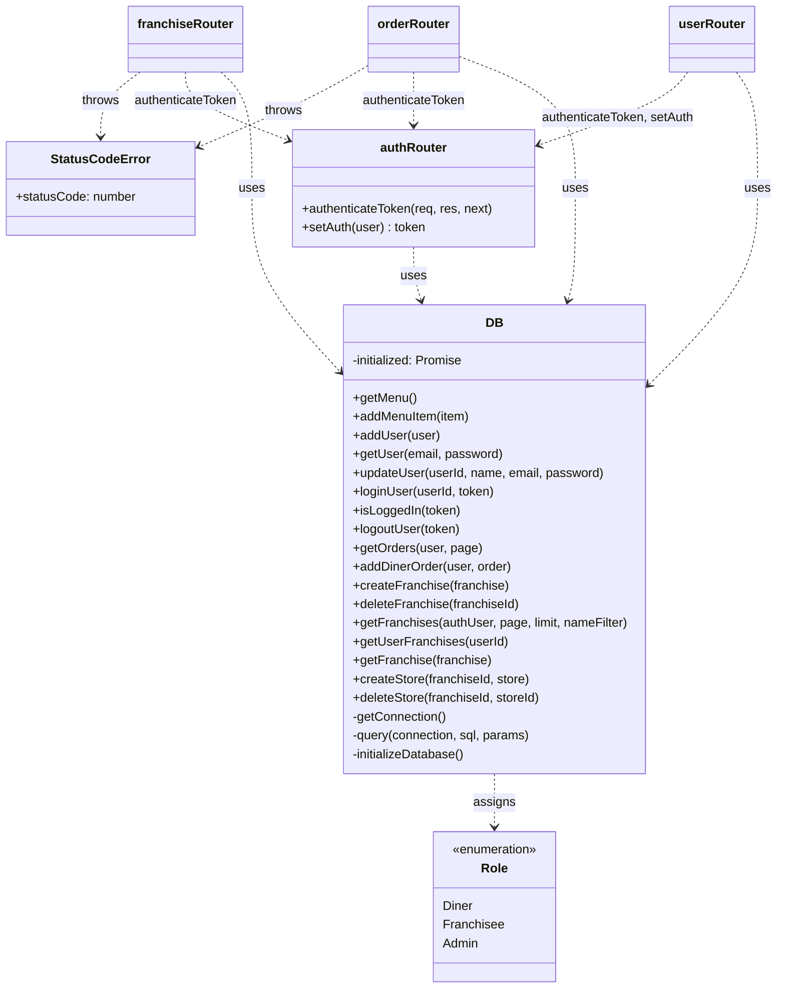
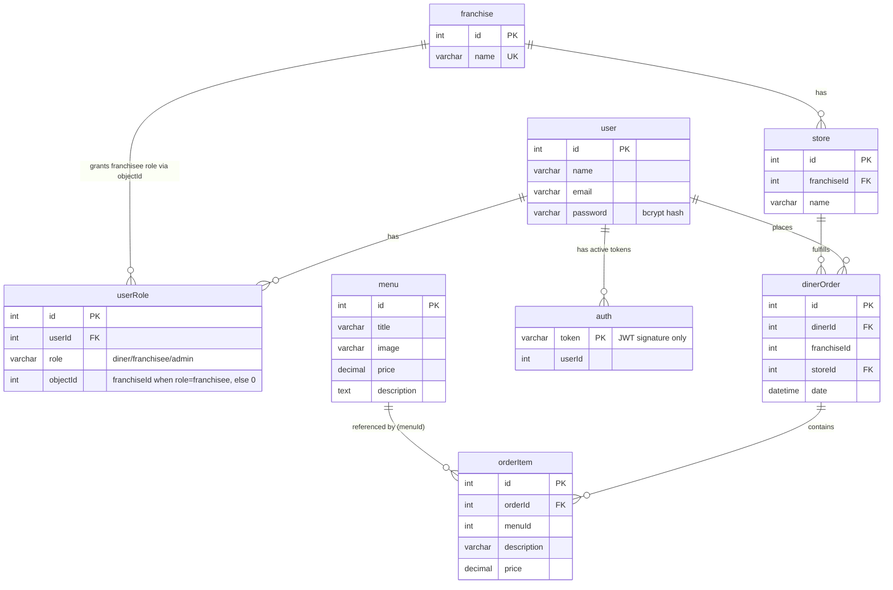

# jwt-pizza-service Architecture

This document is a guided tour of the codebase for engineers who are new to the
project. It covers what the service does, how a request flows through the
code, how the pieces fit together, and where to look when you need to change
something.

## 1. What this service is

`jwt-pizza-service` is the backend API for the JWT Pizza product. It is a
single Node.js/Express process that:

- Registers, authenticates, and manages users (`/api/auth`, `/api/user`)
- Manages franchises and their stores (`/api/franchise`)
- Manages the pizza menu and diner orders (`/api/order`)
- Delegates the actual "making" of a pizza to an external **Pizza Factory**
  service over HTTP, and returns the factory's JWT/report link to the caller

Authentication is JWT-based: on register/login the service signs a JWT
containing the user's id, name, email, and roles, and also stores the token's
signature in a `auth` table so tokens can be explicitly invalidated on
logout (a plain JWT can't be revoked on its own).

Persistence is MySQL, accessed directly with parameterized SQL via
`mysql2/promise` — there is no ORM.

## 2. Runtime architecture



Key files:

| Path | Responsibility |
|---|---|
| [src/index.js](src/index.js) | Process entry point. Starts the HTTP server on a port (`argv[2]` or 3000). |
| [src/service.js](src/service.js) | Builds and configures the Express `app`: JSON parsing, auth middleware, CORS headers, route mounting, `/api/docs`, 404 handler, error handler. |
| [src/config.js](src/config.js) | Static configuration: JWT secret, DB connection info, Pizza Factory URL/API key. **Not** environment-driven — this file is edited directly per deployment (see §7). |
| [src/routes/authRouter.js](src/routes/authRouter.js) | Register, login, logout; also exports the `setAuthUser` middleware and `authenticateToken` guard used by the other routers. |
| [src/routes/userRouter.js](src/routes/userRouter.js) | Get/update the current user (self-service or admin). |
| [src/routes/orderRouter.js](src/routes/orderRouter.js) | Menu CRUD (read/add) and diner order creation, including the call out to the Pizza Factory. |
| [src/routes/franchiseRouter.js](src/routes/franchiseRouter.js) | Franchise and store CRUD. |
| [src/database/database.js](src/database/database.js) | The `DB` class — all SQL lives here. Exported as a ready-made singleton instance. |
| [src/database/dbModel.js](src/database/dbModel.js) | `CREATE TABLE IF NOT EXISTS` statements, run at startup to self-provision the schema. |
| [src/model/model.js](src/model/model.js) | The `Role` enum (`diner`, `franchisee`, `admin`) shared across routers and DB. |
| [src/endpointHelper.js](src/endpointHelper.js) | `asyncHandler` (wraps async route handlers so rejected promises reach Express's error handler) and `StatusCodeError` (an `Error` subclass carrying an HTTP status code). |
| [src/init.js](src/init.js) | One-off CLI script (`node init.js <name> <email> <password>`) to create an admin user directly against the DB. |

## 3. Request lifecycle

Every request passes through the same middleware chain before reaching a
router, defined in [service.js](src/service.js):



`setAuthUser` (in [authRouter.js](src/routes/authRouter.js)) runs on **every**
request, not just protected ones. It looks for an `Authorization: Bearer
<token>` header, checks the token's signature against the `auth` table in
MySQL (so a logged-out token is rejected even though the JWT itself is still
cryptographically valid), and if valid, verifies and decodes the JWT into
`req.user`. It also attaches a convenience method `req.user.isRole(role)`.

Individual route handlers that require a logged-in user call
`authRouter.authenticateToken` as route middleware, which simply checks that
`req.user` was populated and otherwise returns `401`.

Route handlers that require a specific role (e.g. admin-only) check
`req.user.isRole(Role.Admin)` themselves and throw a `StatusCodeError` (403)
if the check fails — there's no generic role-based middleware, it's inline
per-route.

## 4. Authentication & authorization sequence



Notable details:

- **Only the JWT signature** (the 3rd dot-separated segment) is stored in the
  `auth` table (`getTokenSignature`), not the whole token.
- Logout (`DELETE /api/auth`) deletes that row, which is what makes the JWT
  "invalid" from then on even though `jwt.verify` would still succeed on it.
- Passwords are hashed with `bcrypt` (cost factor 10) before being stored;
  plaintext passwords never touch the `user` table.
- `config.jwtSecret` is a static string in `config.js` — anyone with that
  secret can mint valid tokens, so protecting `config.js` in deployment is
  important.

## 5. Order creation & the Pizza Factory integration

Creating an order is the one place this service talks to another service:



The order is persisted locally (`dinerOrder` / `orderItem` tables) **before**
the factory call, so the diner's order history is durable even if the
factory call fails.

## 6. Domain model / class overview



`DB` is instantiated once at the bottom of `database.js` (`const db = new
DB()`) and exported as a ready-made singleton — every router imports the same
instance rather than constructing their own. The constructor kicks off
`initializeDatabase()` (creates the schema if missing, seeds a default admin
user `a@jwt.com` / `admin`) and stores the resulting promise in
`this.initialized`; every other method awaits that promise first via
`getConnection()`, so callers never race the schema setup.

Each DB method opens its own short-lived MySQL connection (`getConnection` →
`mysql.createConnection`) and closes it in a `finally` block — there is no
shared connection pool.

## 7. Database schema (entity relationships)

Schema is defined declaratively in [dbModel.js](src/database/dbModel.js) and
applied with `CREATE TABLE IF NOT EXISTS` on every startup, so the DB
self-provisions against a bare MySQL instance.



Things worth knowing:

- `userRole` is a generic role-assignment table: `role='admin'`/`'diner'`
  rows use `objectId=0` (meaningless), while `role='franchisee'` rows use
  `objectId` as the **franchise id** the user administers. This is how
  "franchise admins" are modeled without a separate table.
- `auth.token` stores only the JWT **signature**, not the full token, used as
  a revocation list (see §4).
- There are no foreign keys enforcing `dinerOrder.storeId` against `store`
  end-to-end at the DB level beyond what's listed above — check
  `dbModel.js` if you're changing this schema, since MySQL will reject
  malformed FK references at startup.

## 8. Error handling conventions

- Route handlers are wrapped in `asyncHandler` (`endpointHelper.js`), which
  forwards rejected promises to `next(err)` so they reach Express's central
  error middleware instead of crashing the process or hanging the request.
- Expected/domain errors are thrown as `new StatusCodeError(message,
  statusCode)` (e.g. 403 for role checks, 404 for unknown user, 500 for a
  failed franchise-delete transaction). Anything else bubbles up as a plain
  `Error` and is reported as a 500.
- The final error handler in `service.js` responds with `{ message, stack }`
  — note this **includes the stack trace in the HTTP response body**, which
  is convenient for local development but worth being aware of if this
  service is ever exposed with that behavior unchanged in production.

## 9. Configuration & environment

- All configuration (JWT secret, DB credentials, Pizza Factory URL/API key)
  lives in [src/config.js](src/config.js), a plain CommonJS module — there is
  no `.env`/`dotenv` loading in the service code itself. `.env.development`
  and `.env.production` exist at the repo root but are consumed by tooling
  outside this file (e.g. deploy scripts), not by `config.js` directly.
- `deployService.sh` at the repo root handles packaging/deploying the
  service; check it before assuming any additional runtime wiring.
- Because secrets currently live directly in `config.js`, treat that file as
  sensitive — don't commit real production secrets to a shared branch.

## 10. Running locally

```sh
npm install
npm start        # cd src && node index.js — starts on port 3000
```

or, with hot reload during development (`nodemon` installed globally):

```sh
cd src && nodemon index.js
```

A local MySQL instance matching `config.js`'s `db.connection` settings must
be reachable — the service creates the `pizza` database and its tables
automatically on first startup, and seeds a default admin user
(`a@jwt.com` / `admin`).

Self-documenting endpoint list (method, path, description, example curl,
sample response) is available at:

```sh
curl localhost:3000/api/docs
```

This is generated from the `docs` array each router exports (see the
`*.docs` arrays at the top of each file in `src/routes/`) — when adding a new
endpoint, add a matching entry there so it stays discoverable.

## 11. Notable gaps / things to know before extending

- `userRouter`'s `deleteUser` and `listUsers` endpoints are stubs
  (`'not implemented'`) — routes exist and are documented but not
  functional.
- There is no automated test suite in this repository at the time of
  writing (no `test` script, no test files) — the coverage badge in
  `README.md` is produced by CI infrastructure external to this repo.
- `franchiseRouter`'s `deleteFranchise` route does **not** call
  `authenticateToken` or check for admin role, unlike every other mutating
  route in that router — worth confirming this is intentional before relying
  on it.
- DB connections are opened and closed per call rather than pooled; under
  load this is a place to look first if you see connection-related latency
  or MySQL `max_connections` errors.
